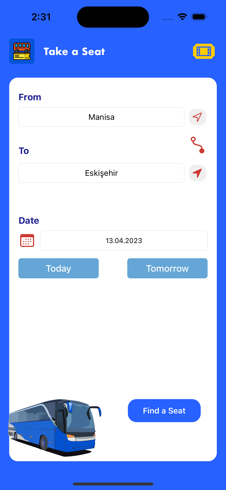
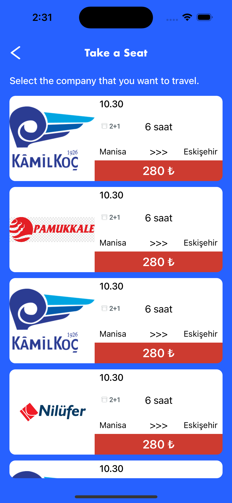
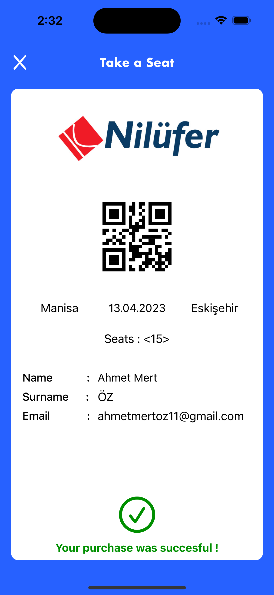

# Take a Seat

<b>Take a Seat, UIKit ile yapılmış olup kullanıcının kalkış ve varış noktasını seçip, kendine uygun seferi bulup, o seferde maksimim 5 adet olacak şekilde koltuk seçebildiği ve bu girdiler doğrultunda belirli sefer için bilet oluşturabildiği bir mobil uygulamadır.</b>

Kullanilan Api : https://pokeapi.co/api/v2/pokemon

## Uygulamanın Amacı
Bu uygulamanın amacı Take a Seat, UIKit ile yapılmış olup kullanıcının kalkış ve varış noktasını seçip, kendine uygun seferi bulup, o seferde maksimim 5 adet olacak şekilde koltuk seçebildiği ve bu girdiler doğrultunda belirli sefer için bilet oluşturabildiği bir mobil uygulamadır.
<ul>
<li> Infinite Scroll Kullanılmıştır. </li>
<li> Arama yapılan pokemon dinamik olarak güncellenmektedir. </li>
<li> Firebase ile Remote Config sağlanarak arkaplan rengi değişebilmektedir. </li>
<li> Crashliytcs ile çökmeler raporlanmaktadır. </li>
<li> Temel eventler console üzerinden raporlanmaktadır. </li>
</ul>

  

## Nasıl Kurulur?
Projeyi Xcode ile clone ettikten sonra, proje klasöründe "pod install" komutunu terminal üzerinde çalıştırdıktan sonra .xcworkspace dosyası ile projeyi açabilirsiniz.
 
# 💻 Teknolojiler 
- Swift
- ALBusSeatView

[Linkedin](https://www.linkedin.com/in/ahmet-mert-öz)

[E-posta](ahmetmertoz11@gmail.com)
