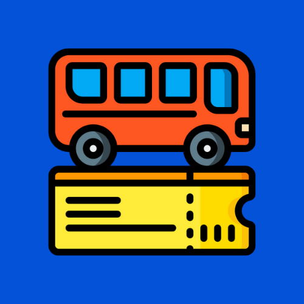

# Take a Seat

<b>Take a Seat, UIKit ile yapılmış olup kullanıcının temel bir bilet satın alma uygulamasında bulunan özellikleri yerine getiren bir mobil uygulamadır.</b>

## Uygulamanın Amacı
Bu uygulamanın amacı kullanıcının kalkış ve varış noktasını seçip, kendine uygun seferi bulup, o seferde maksimim 5 adet olacak şekilde koltuk seçebildiği ve bu girdiler doğrultunda belirli sefer için bilet oluşturabilmektir. Ardından bu bileti bilet geçmişi sayfasında görüntüleyebilmektir.
<ul>
<li> Storyboard kullanılmıştır. </li>
<li> Oluşturulan bilet cihaza local şekilde kaydedilmektedir. </li>
<li> ALBusSeat ile koltuk seçme işlemi gerçekleştirilmiştir. </li>

</ul>

  

## Nasıl Kurulur?
Projeyi Xcode ile clone ettikten sonra, proje klasöründe "pod install" komutunu terminal üzerinde çalıştırdıktan sonra .xcworkspace dosyası ile projeyi açabilirsiniz.
 
# 💻 Teknolojiler 
- Swift
- ALBusSeatView

[Linkedin](https://www.linkedin.com/in/ahmet-mert-öz)

[E-posta](ahmetmertoz11@gmail.com)
